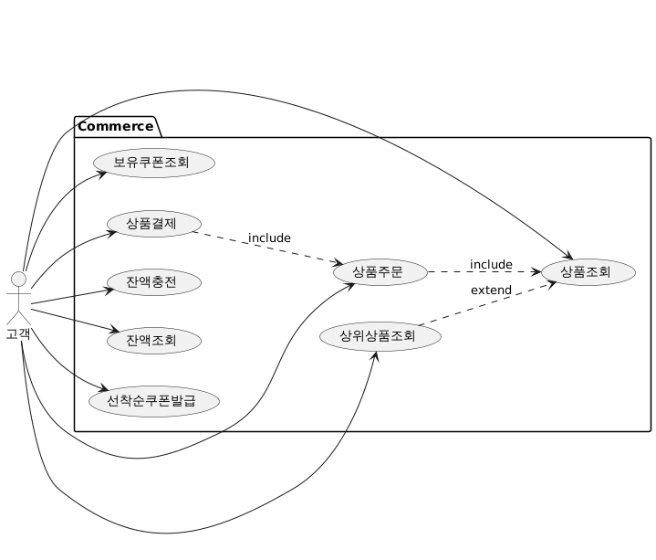
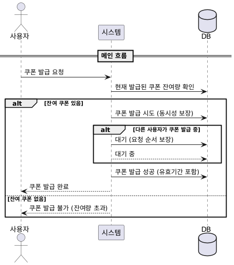
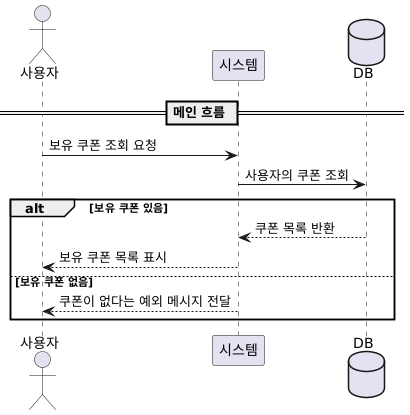
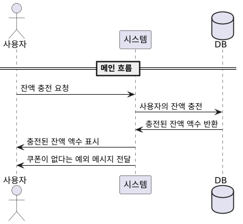
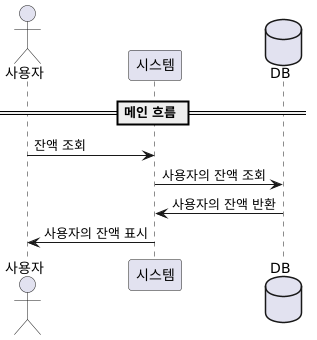
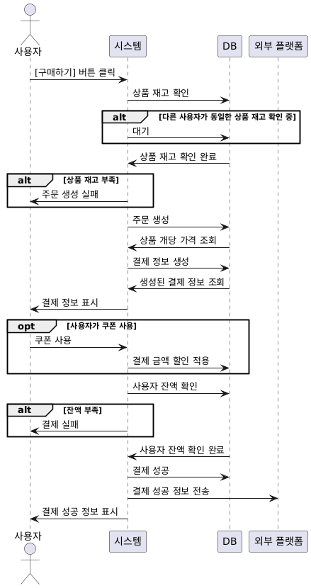
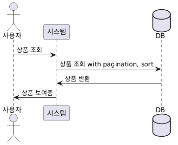
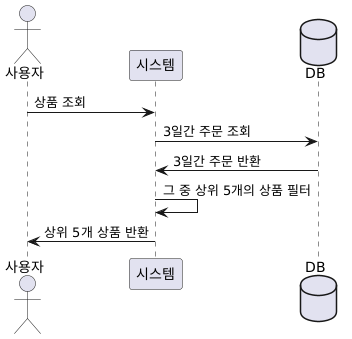
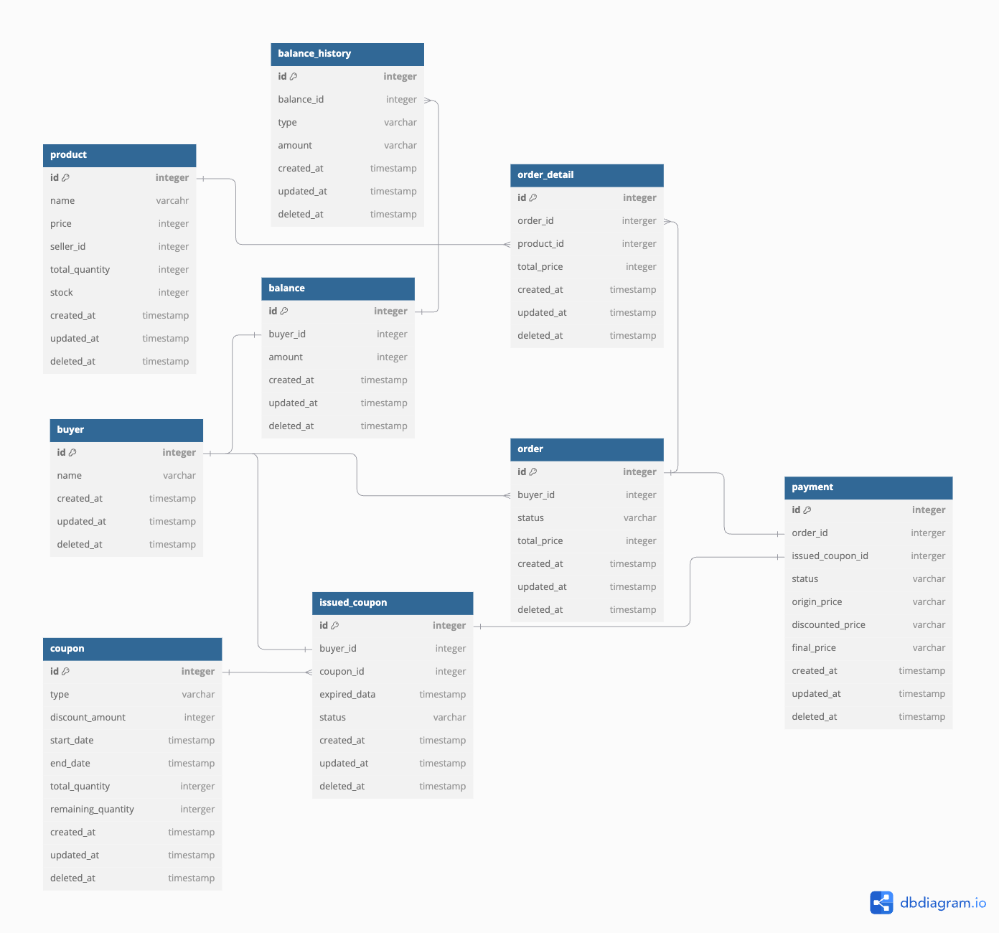
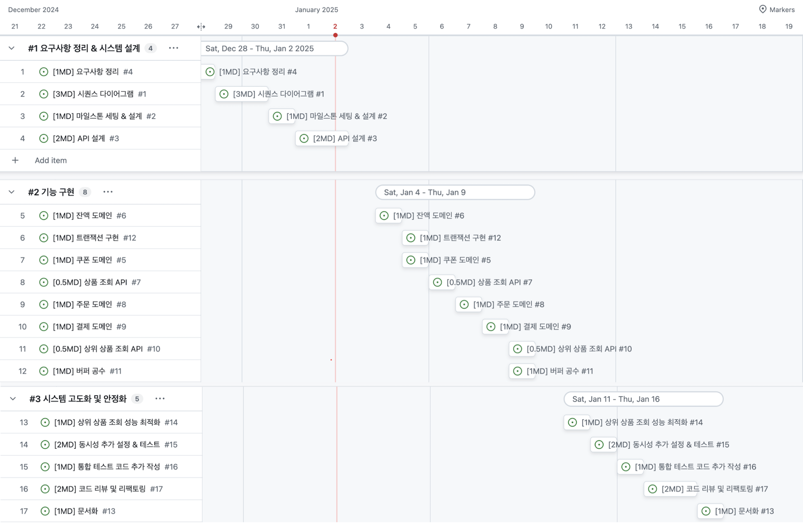

### db migration

```bash
npm run migration:generate {migration_name} // 마이그레이션 파일 생성
npm run migration:run // 마이그레이션 실행
npm run migration:seed // 시드 실행
npm run schema:generate // 스키마 생성
```


### Use Case



### 도메인
usecase 중에서 묶을 수 있는 명사를 기준으로 도메인 추출 시도

- 잔액 : balance
- 쿠폰 : coupon
- 상품 : product
- 주문 : order
- 결제 : payment

<br/>

### 시퀀스다이어그램
- 선착순 쿠폰 발급  

  

- 보유 쿠폰 목록 조회  

  

- 잔액 충전  

  

- 잔액 조회  

  

- 주문 & 결제  

  

- 상품 조회  

  

- 상위 상품 조회

  


### API 목록
- 발급 가능 쿠폰 조회 API
- 선착순 쿠폰 발행 API
- 발행된 내 쿠폰 조회 API
- 잔액 충전 API
- 잔액 조회 API
- 주문 API
- 결제 API
- 상위 상품 조회 API
- 상품 조회 API

### ERD



### 마일스톤




### 성능 테스트 명령어

0. k6 설치
```bash
brew install k6
```

1. 포인트 충전
```bash
k6 run --verbose load-test/charge-balance.js
```

2. 주문

```bash
k6 run --verbose load-test/make-order.js
```

3. 결제

```bash
k6 run --verbose load-test/make-payment.js
```


4. 쿠폰 발급

```bash
k6 run --verbose load-test/issue-coupon.js
```
